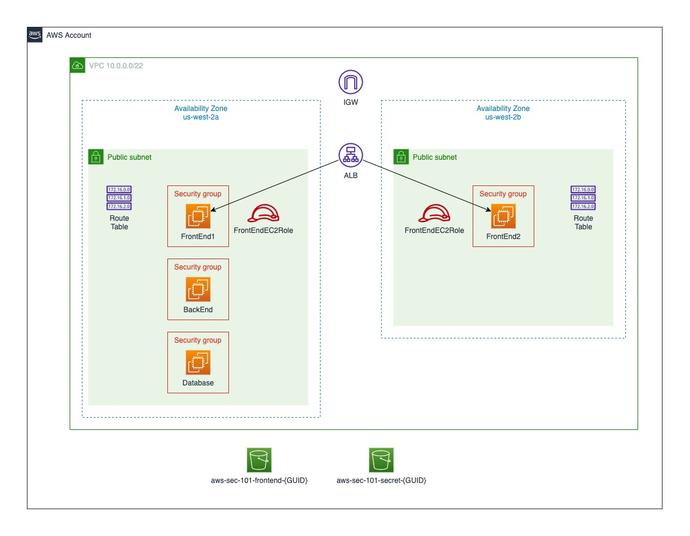

# Runbook

## Resource Deployment

### Prerequisites

- An AWS account
- AWS CLI (locally installed or using the AWS Cloud Shell)

Supported Regions:

- AWS N. Virginia (us-east-1)
- AWS Ohio (us-east-2)
- AWS N. California (us-west-1)
- AWS Oregon (us-west-2)
- Canada (Central) (ca-central-1)

Default region is `us-west-2` (regardless of the settings in your AWS CLI profile). To change the region, update `AWS_REGION` variable in `deploy.sh` and `destroy.sh`.

### Directions

Run `deploy.sh` to deploy.

Deployment takes approx. 5 minutes to complete. The resources were chosen from the AWS Free Tier. If you recently signed up for an AWS account then you may have available credits that can be used towards this deployment. For example, the deployed EC2 instance type is t3.micro and AWS provides 720 hours of free compute time. After 720 hours of usage AWS will charge for the EC2 usage.

**Disclaimer:**
> While efforts were made to minimize AWS costs, the deployed solution may not be entirely free. For example, an AWS Load Balancer requires at least two endpoints in two availability zones. AWS charges a small amount for inter-availability zone traffic.

## Architecture

The following architecture is deployed by the CloudFormation template:

**Disclaimer:**
In an enterprise setting you likely would choose a different architecture, perhaps one with private connectivity such as Direct Connect or VPN.

This is not a traditional three-tier architecture with private and public subnets. However, this architecture allows outbound Internet access without the use of an expensive NAT Gateway. Outbound Internet is required for patching and AWS SSM Session Manager. The traditional three-tier architecture allows use of AWS NACLs between the application tiers. NACLs can only be applied at the subnet level so it's not possible to leverage them in our architecture.

AWS Instance Connect requires inbound connectivity to the EC2 servers. The Front End AWS Security Groups allow inbound connectivity (ssh port 22) from the specific AWS Instance Connect CIDR. Additionally the security groups allow the Application Load Balancer to reach port 80 on the Front End EC2 servers.

Use AWS Instance Connect or SSM session manager for EC2 shell access.

- Log into the AWS management console and navigate to the EC2 console
- Click on Instances
- Select the instance and click on Actions and then Connect
- Choose either Instance Connect or Session Manager

## Resource Clean Up

All deployed resources can be removed by running `destroy.sh`.
